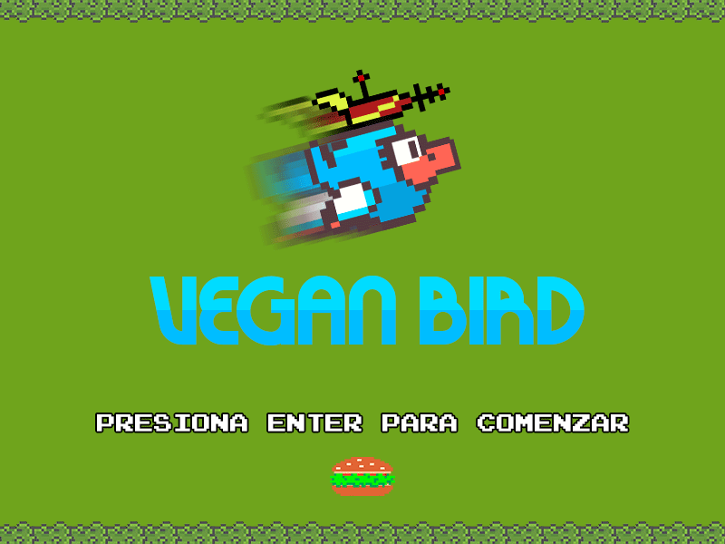
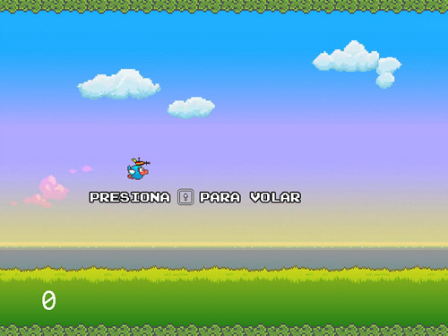
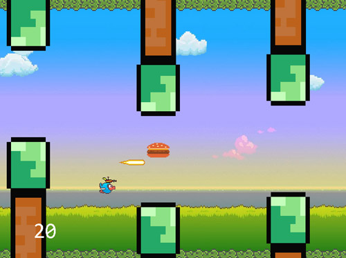
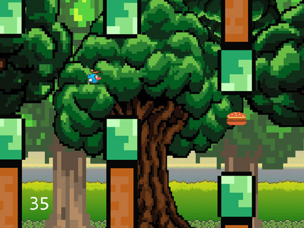
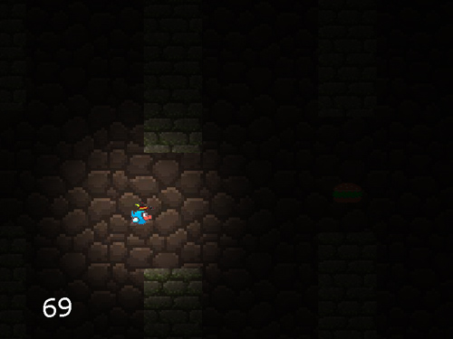

# Vegan Bird

Juego realizado como parte del proyecto de la materia Programación I del primer año de la carrera Licenciatura en Sistemas de la Universidad Nacional General Sarmiento.

## Tabla de contenidos

- [Introducción](#introducción)
- [Controles](#controles)
- [Niveles](#niveles)
- [Clases](#clases)
- [Logros](#logros)
- [Contribución](#contribución)
- [Instalación](#instalación)

## Introducción

Vegan Bird está basado en el popular juego "Flappy Bird", hecho como parte de un proyecto universitario. 
El juego consiste en esquivar la mayor cantidad de obstáculos posibles y obtener el mayor puntaje. El puntaje se obtiene al consumir <i>hamburguesas veganas</i>. Una de las principales dificultades del juego es la aparición aleatoria de hamburguesas de carne, que al consumirlas restan puntos. Para evitarlas se puede esquivar la hamburguesa o dispararle con el <i>rayo conversor</i> que se ubica en la cabeza del personaje. Si el disparo llega al objetivo, la hamburguesa se convertirá en vegana y podrá ser consumida.



## Controles

El personaje tiene la capacidad de <i>volar</i> con saltos que se efectúan pulsando el cursor "arriba". Por cada presión de tecla, el personaje se mueve horizontalmente hasta un punto en el que vuelve a descender.
Los disparos del <i>rayo conversor</i> se realizan con la tecla "espacio". La cadencia de disparo es de 1, solo se puede volver a disparar cuando el rayo colisiona con un objeto o sobrepase el límite de la pantalla.

## Niveles

- Pradera: Es el primer nivel, la velocidad del personaje es normal.
- Bosque: Luego de sumar una cierta cantidad de puntos se pasa al nivel del bosque, donde la velocidad del personaje se incrementa.
- Cueva: Es el nivel final, se reduce considerablemente la visión del entorno.

<table style="width:100%">
<tr>
<td>
<a>

</a>
</td>
<td>
<a >

</td>
<td>
<a>

</a>
</td>
<td>
<a>

</a>
</td>
</tr>
</table>

## Clases

La mayoría de las clases coinciden en algunas variables de instancia, como <i>x</i>, <i>y</i>, <i>ancho</i>, <i>alto</i>. En las dos primeras se guarda la ubicación en pantalla del objeto, y en las dos últimas las proporciones.

También la clase Pájaro y las clases que interactúan entre sí directamente tienen un método de colisión llamado <i>toca</i> que se explicará luego de las clases.

### Pajaro

Contiene métodos que determinan la ubicación y el estado del personaje.

- dibujarPajaro(Entorno entorno, boolean ponerOscuro): Recibe como parámetro un booleano que indica si el pájaro llegó a la máxima dificultad. Si la variable es verdadera, se dibuja la figura del personaje acompañada de una pantalla oscura que sólo permite una reducida visión alrededor de él. Si es falsa significa que no llegó a la máxima dificultad y sólo se dibuja el personaje.
- terminoSaltar(double limite, double pos_actual): Cuando se presiona la tecla para saltar, en la clase Juego se resta 100 a la posición en eje Y que tiene en ese instante y se envía como parámetro a este método junto con la posición actual. De esta forma, le damos un límite al salto. Por ejemplo: si el pájaro está en la posición 250 y presiona el botón "saltar", se le resta 100 y quedará como límite 350. Entonces, el personaje recorrerá automáticamente desde 250 hasta 350 y luego caerá.
- Boolean <i>enProceso</i>: Indica al programa si el pájaro está actualmente saltando.
La clase no permite modificaciones en la variable X como consecuencia de que el personaje sólo se mueve en el eje Y.

Las variables de posición y dimensión no pueden ser negativas porque las coordenadas en pantalla son positivas. Tampoco puede pasar el valor 600 que es el límite inferior del área de juego.

### Tubos

- dibujarTubo(Entorno entorno, String orientacion, boolean esLadrillo): Dibuja en pantalla los obstáculos dependiendo de dos parámetros: Si <i>esLadrillo</i> es falso se dibujan árboles en dos ángulos distintos determinados por la variable <i>orientación</i>. En cambio, si es verdadero se dibuja un obstáculo con textura de ladrillos ambientando la escena de la cueva.
- moverTubo(int puntos): Dependiendo del parámetro <i>puntos</i> los obstáculos se desplazarán a dos o tres pixeles en eje Y.
- Boolean <i>cruzo</i>: Cuando el obstáculo superó el límite izquierdo de la pantalla, esta variable se encarga de avisar a la clase Juego que se debe crear una nueva ubicación aleatoria de dicho objeto.

Entre sus invariantes se debe tener en cuenta la posición que se ingresa al crear un objeto para que no aparezca muy cerca del contiguo.

### Hamburguesa

En esta clase se modelan los dos tipos de hamburguesas.

- dibujarHamburguesa(Entorno entorno): Si la variable <i>tipo</i> es verdadera, se dibuja una hamburguesa vegana. De lo contrario, se dibuja una no vegana.
- moverHamburguesa(int puntos): mismo comportamiento que moverTubo (clase Tubos).
- aleatorio(double tuboX, double tuboY): Este método tiene dos objetivos, el primero es determinar el tipo de hamburguesa mediante un random. El segundo es indicar al programa si la hamburguesa va a aparecer en pantalla (también con un random).
- int <i>indice</i> y <i>aleatorio</i>: Ambas variables se encargan de almacenar el resultado del número random que se calcula.

Las variables de posición y dimensión no pueden ser negativas porque las coordenadas en pantalla son positivas.

Las hamburguesas no pueden estar por encima ni por debajo de un obstáculo. Aparecen de forma aleatoria entre el obstáculo inferior y superior con un rango aleatorio que permite que nunca comparta coordenadas con los obstáculos.

### Rayo 

Al comenzar el juego, el objeto está inicializado en -100 para que esté dibujado fuera de la pantalla, lo mismo sucede si el usuario no presiona la tecla para disparar. Una vez que el jugador lo presiona, desde la clase Juego se envía la posición en la que se disparó y a partir de ese punto se desplaza horizontalmente a la derecha hasta colisionar con un objeto.

- Boolean <i>disparo</i>: Funciona para indicar si el usuario realizó un disparo.

### Puntos

La clase Puntos se encarga de guardar el puntaje y de controlar el nivel actual del jugador.

- calcularPuntaje(boolean tipo): Recibe como parámetro el tipo de hamburguesa que el personaje recolectó. Si es verdadero se suman cinco puntos, y se restan cinco si es falso.

### PisoTecho

La única función de ésta clase es guardar las coordenadas de los límites inferior y superior del área donde puede moverse el personaje.

### ManejoDeArchivos

Se encarga de leer y escribir el puntaje obtenido en una partida en un documento de texto. También calcula entre el historial de puntajes el mejor obtenido y lo envía a la clase Juego para que luego se muestre al finalizar cada partida.

- guardarLista(String archivo): Lee el archivo y convierte cada punto que está en tipo String en int y lo guarda en una lista.
- record(ListaInt lista): Con el paquete Listas se encarga de llamar al método <i>maximo()</i> y retornar el puntaje más alto.

### Grafica

Actúa como un repositorio. Aquí se guardan todas las imágenes que se usan en el juego. Se envían a las demás clases a través de getters.

### Arbol, Cueva y Fondo

Tienen funciones similares, se encargan de dibujar el fondo del juego.

- mover() y moverLento(): El objetivo de estos dos métodos, que son implementados en la clase Arbol y la Clase Fondo, es dar un efecto de profundidad al fondo del entorno. Este efecto es comunmente conocido como "Parallax".
- moverEntrada(): Pertenece a la clase Cueva y tiene una función única que es recorrer la imagen de una entrada hacia el extremo izquierdo y, desde la clase Juego se toma su posición en Y para que una vez que cruza, se activa el modo "oscuro" del juego.

### Método de colisión de objetos

El método <i>toca()</i> es el que contiene el algoritmo de colisión entre los objetos del juego. Como primer paso, calcula el módulo de la resta de cada eje obteniendo la distancia entre los centros de dos objetos. Y por último, consulta si la distancia es menor a la mitad del objeto al que pertenece el método. Si la condición es verdadera, resulta una colisión.

## Logros

Durante el desarrollo del juego, se evidenció la importancia de programar de forma clara y coherente, también se vio la importancia de saber leer código ajeno y compartir ideas, encontrar problemas e investigar a fondo las soluciones. También saber repartir responsabilidades y cumplir con tiempos determinados.

## Contribución

Puedes hacer un fork del proyecto para hacer tus aportes. Se pueden agregar nuevos niveles, nuevas dificultades, un botón de reinicio del juego o una tabla de puntajes con el nombre del jugador.

## Instalación

```shell
-- en el directorio donde quieras el proyecto
git clone https://github.com/elez95/Vegan-Bird.git
```
